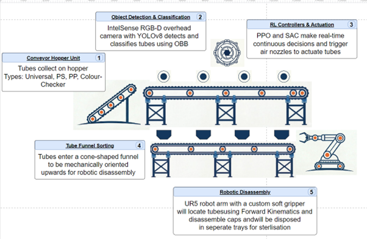

# Digital Twin of Reinforcement Learning Driven Medical Tube Segregation & Disassembly

### Sustainable Automated Plastic Sorting using Reinforcement Learning, Computer Vision and Robotics


---

## Overview

This project presents a **digital twin framework for intelligent medical plastic recycling**, combining:

- Computer Vision for tube detection
- Reinforcement Learning for adaptive sorting
- Pneumatic actuation for tube segregation
- Robotic disassembly using a UR5 manipulator
- Circular Economy principles for sustainable plastic reuse

The system autonomously:

✅ Detects medical tubes  
✅ Classifies tube type  
✅ Decides optimal air jet timing  
✅ Sorts tubes into bins  
✅ Transfers tubes for robotic disassembly  
✅ Separates lids from bases for sterilisation/recycling

---

## Project Pipeline



---

## Technologies Used

- Python
- PyBullet
- Gymnasium
- Stable-Baselines3
- OpenCV
- YOLOv8
- NumPy
- Matplotlib

---

## Reinforcement Learning

The control problem is formulated as a **Markov Decision Process (MDP)**.

### State Space

```python
[y_position, width, height, angle, class_index]
```

### Action Space

```python
[Jet1, Jet2, Jet3, Jet4, Jet5]
```

Where:

- `0 = OFF`
- `1 = ON`

Algorithms tested:

- **Proximal Policy Optimisation (PPO)**
- **Soft Actor-Critic (SAC)**

---

## Results

| Tube Type | PPO Success | SAC Success |
|----------|------------|------------|
| Polypropylene 1 | 62% | 64% |
| Polypropylene 2 | 60% | 79% |
| Polystyrene 1 | 63% | **81%** |
| Polystyrene 2 | 74% | 72% |
| Lysis Tube | 56% | 69% |

### Key findings:

- Sorting improved from **~20% → 81%**
- SAC achieved highest peak performance
- PPO produced most stable convergence
- Robotic disassembly reached **72–85% success**

---

## Repository Structure

```bash
project/
│── assets/
│── models/
│── yolo/
│── environments/
│── robotics/
│── logs/
│── train_ppo.py
│── train_sac.py
│── evaluate.py
│── detection.py
└── README.md
```

---

## Future Work

- Sim-to-real transfer
- Domain randomisation
- Real pneumatic latency modelling
- Continuous pressure modulation
- Transformer-based detection
- Multi-material sorting

---

## Author

**Jessiah Buamah**  
Final Year Engineering Project  
Reinforcement Learning • Robotics • Computer Vision • Sustainable Automation
